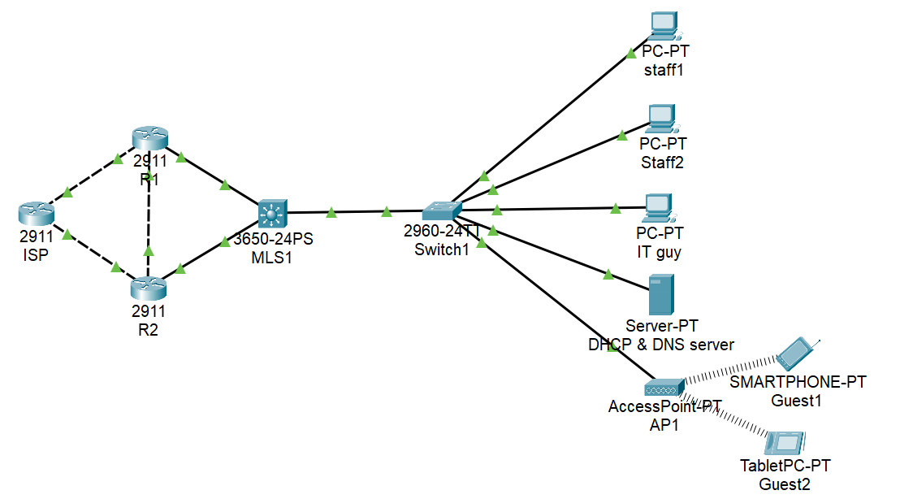
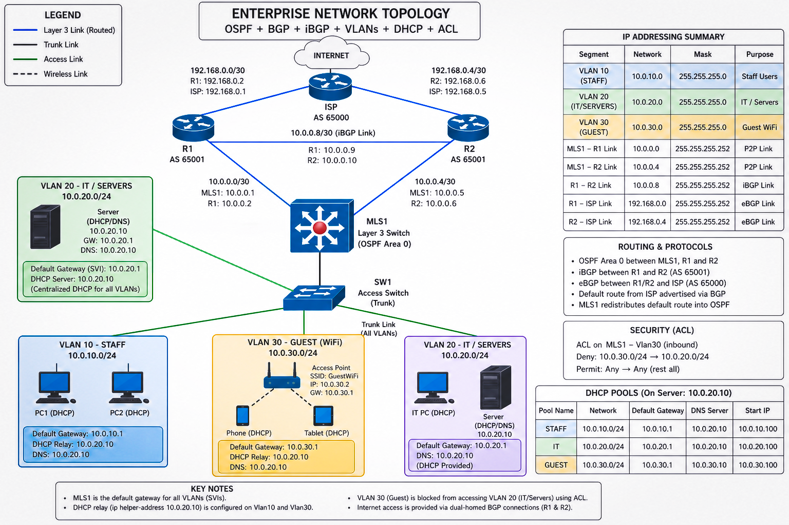

# 🌐 Enterprise Network Lab: Multi-VLAN + OSPF + BGP

### Secure, Redundant Enterprise Infrastructure Simulation

**Lead Engineer:** Isiphile Maqhashu
**Status:** Stable | Dual-Homed | Policy-Enforced

---

## Executive Summary

This project implements a scalable enterprise network architecture designed to simulate real-world routing, segmentation, and security practices. The network supports multiple user groups, centralized services, wireless guest access, and redundant ISP connectivity.

The design leverages a combination of **Layer 2 and Layer 3 technologies**, including VLAN segmentation, inter-VLAN routing, OSPF for internal route propagation, and BGP for external connectivity. Redundancy is achieved through dual edge routers configured with both **eBGP and iBGP**, ensuring high availability and consistent route awareness.

Security is enforced through access control policies that restrict unauthorized lateral movement, particularly isolating guest users from sensitive internal resources.

This project demonstrates not only implementation, but also **design reasoning, failure handling, and structured troubleshooting**.

---

## Architecture & Topology

The network follows a hierarchical model consisting of:

* **Core Layer:** Multilayer Switch (MLS1)
* **Edge Layer:** Dual Routers (R1 and R2)
* **Access Layer:** Layer 2 Switch (SW1)
* **External Network:** Simulated ISP
* **Infrastructure Services:** DHCP/DNS Server
* **Wireless Access:** Access Point for guest devices

---

### Segmentation (VLAN Design)

| ID     | Zone      | Subnet       | Description                |
| ------ | --------- | ------------ | -------------------------- |
| **10** | **Staff** | 10.0.10.0/24 | Employee endpoints         |
| **20** | **IT**    | 10.0.20.0/24 | Servers and infrastructure |
| **30** | **Guest** | 10.0.30.0/24 | Wireless users (isolated)  |

---

### WAN / Routing Links

| Link      | Network        |
| --------- | -------------- |
| MLS1 ↔ R1 | 10.0.0.0/30    |
| MLS1 ↔ R2 | 10.0.0.4/30    |
| R1 ↔ R2   | 10.0.0.8/30    |
| R1 ↔ ISP  | 192.168.0.0/30 |
| R2 ↔ ISP  | 192.168.0.4/30 |

---

## Routing Architecture

### Internal Routing — OSPF

OSPF is deployed across the internal network (MLS1, R1, R2) to dynamically exchange routes between VLANs and routing domains.

* Area: 0 (single-area design)
* Purpose: Fast convergence and scalability
* Result: All internal networks are dynamically reachable without static routes

---

### External Routing — BGP

Each edge router establishes an **eBGP session** with the ISP (AS 65000).

* Local AS: 65001
* Purpose: Simulate real-world internet routing
* Behavior: Receives default route from ISP

---

### Internal BGP — iBGP

An iBGP session is configured between R1 and R2.

* Purpose: Share external routes internally
* Outcome:

  * Redundant internet paths
  * Consistent routing decisions
  * Failover capability

---

### Default Route Propagation

The default route learned via BGP is injected into OSPF from R1.

* Command used: `default-information originate`
* Result: Internal devices gain internet reachability without manual configuration

---

## Services & Infrastructure

### Centralized Server (VLAN 20)

* IP Address: 10.0.20.10
* Roles:

  * DHCP Server
  * DNS Server

The server is placed in the IT VLAN to ensure controlled access and security.

---

### DHCP Design

Dynamic IP allocation is configured for all VLANs:

* Staff: 10.0.10.100+
* IT: 10.0.20.100+
* Guest: 10.0.30.100+

### DHCP Relay

Since the server resides in VLAN 20, DHCP relay is configured on MLS1:

* Enables cross-VLAN IP assignment
* Prevents broadcast limitations from blocking DHCP requests

---

## Wireless Implementation

A standalone access point provides connectivity for guest devices.

* SSID: GuestWiFi
* Security: WPA2-PSK
* VLAN: 30 (Guest)

Wireless clients are logically treated as part of the Guest VLAN and inherit all associated restrictions.

---

## Security Implementation

### Access Control Policy

| Source     | Destination | Action  |
| ---------- | ----------- | ------- |
| Guest VLAN | IT VLAN     | Denied  |
| Guest VLAN | Internet    | Allowed |
| Staff VLAN | All         | Allowed |
| IT VLAN    | All         | Allowed |

---

### Enforcement

* Implemented using extended ACLs
* Applied inbound on VLAN 30 interface (MLS1)

### Outcome

* Prevents unauthorized access to critical systems
* Maintains usability for guest users

---

## Key Design Decisions

* **VLAN Segmentation:** Reduces broadcast domains and enforces logical isolation
* **Layer 3 Switching:** Enables efficient inter-VLAN routing at the core
* **OSPF:** Chosen for internal scalability and automation
* **BGP:** Simulates realistic ISP interaction and routing control
* **iBGP:** Provides redundancy and route sharing between edge devices
* **Centralized Services:** Simplifies management and improves consistency
* **ACL Placement:** Blocks unwanted traffic at the source

---

## Troubleshooting & Lessons Learned

This project intentionally included failure scenarios to validate troubleshooting ability.

---

### Issue: No Internet Access from Guest VLAN

* **Cause:** Missing default route in OSPF domain
* **Diagnosis:** `show ip route` on MLS1
* **Resolution:** Inject default route using OSPF

---

### Issue: DHCP Failure Across VLANs

* **Cause:** No DHCP relay configured
* **Diagnosis:** Clients not receiving IP addresses
* **Resolution:** Configure `ip helper-address` on SVIs

---

### Issue: ACL Blocking All Traffic

* **Cause:** Missing permit statement
* **Diagnosis:** No connectivity at all from Guest VLAN
* **Resolution:** Add `permit ip any any`

---

### Issue: OSPF Adjacency Failure

* **Cause:** Missing network statement
* **Diagnosis:** `show ip ospf neighbor`
* **Resolution:** Correct OSPF configuration

---

## Verification & Testing

The following validations were performed:

* Inter-VLAN communication (Staff ↔ IT)
* Guest isolation enforcement
* DHCP assignment across all VLANs
* OSPF neighbor stability
* BGP session establishment
* Internet reachability via both edge routers

---

## Access & Usage

To explore or test the environment:

* **Packet Tracer File:** `packet-tracer/project.pkt`
* **Configurations:** Located in `/configs`
* **Documentation:** Located in `/docs`

Open the `.pkt` file in Cisco Packet Tracer and verify connectivity using built-in tools.

---

## Project Achievements

* [x] Implemented full inter-VLAN routing using Layer 3 switching
* [x] Established dynamic routing with OSPF across all internal devices
* [x] Simulated ISP connectivity using BGP
* [x] Achieved redundancy using dual edge routers and iBGP
* [x] Enforced security policies using ACLs
* [x] Enabled DHCP across multiple VLANs via relay
* [x] Integrated wireless guest access with isolation
* [x] Diagnosed and resolved multiple network failures

---

## Final Remarks

This project reflects a complete network lifecycle:

* Design
* Implementation
* Validation
* Failure simulation
* Troubleshooting
* Documentation

It demonstrates not only technical configuration skills but also the ability to **reason about network behavior, enforce policy, and resolve issues systematically**.

---

*Created by Isiphile Maqhashu – 2026 Network Engineering Portfolio*
